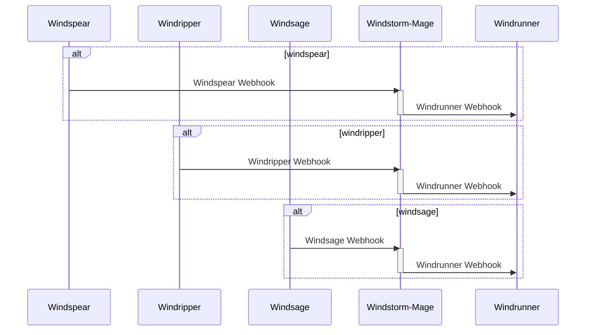

# windstorm-mage

Windstorm Mage is the central webhook that all webhooks forward requests to
after processing their specific information.

## Webhook Sequence.

```mermaid
  sequenceDiagram
    participant Windspear
    participant Windripper
    participant Windsage
    alt windspear
      Windspear->>Windstorm-Mage: Windspear Webhook
      activate Windstorm-Mage
        Windstorm-Mage->>Windrunner: Windrunner Webhook
      deactivate Windstorm-Mage
    end
    alt windripper
      Windripper->>Windstorm-Mage: Windripper Webhook
      activate Windstorm-Mage
        Windstorm-Mage->>Windrunner: Windrunner Webhook
      deactivate Windstorm-Mage
    end
    alt windsage
      Windsage->>Windstorm-Mage: Windsage Webhook
      activate Windstorm-Mage
        Windstorm-Mage->>Windrunner: Windrunner Webhook
      deactivate Windstorm-Mage
    end
```
